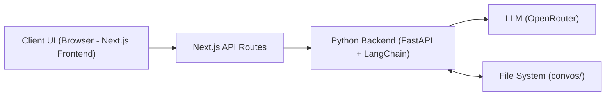
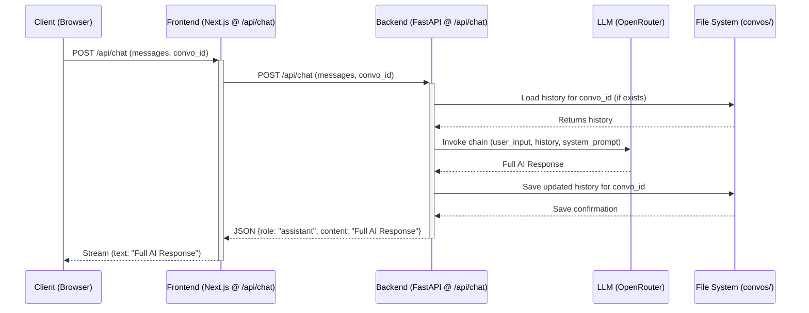
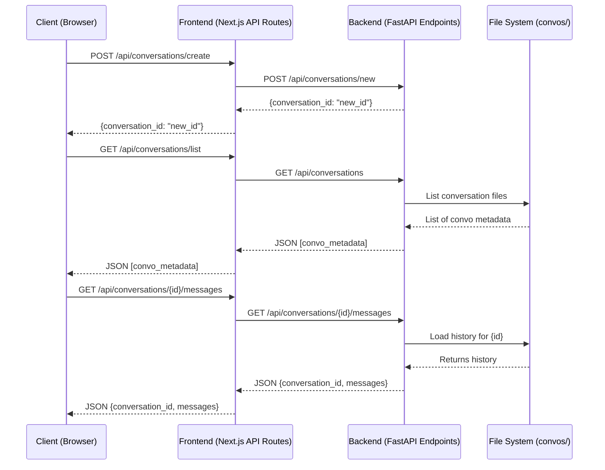
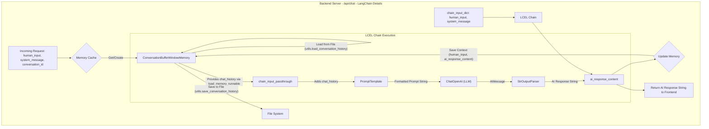

# Project Data Flow Analysis

## 1. Introduction

The purpose of this document is to provide a clear understanding of how data moves through the `tsassistant` application. This includes user interactions on the frontend, processing by the Next.js frontend server, communication with the Python/FastAPI backend, interaction with the Language Model (LLM) via OpenRouter, and finally, how conversation data is persisted to and retrieved from the file system. Understanding this flow is crucial for making informed decisions when modifying or extending the application.

## 2. High-Level Architecture Overview

The `tsassistant` application consists of several key components:

*   **Frontend (Next.js):** The user interface built with Next.js, responsible for capturing user input, displaying chat messages, and managing conversations. It communicates with its own API routes.
*   **Frontend API Routes (Next.js):** These server-side routes within the Next.js application act as an intermediary, forwarding requests to the Python backend and processing responses before sending them to the client.
*   **Backend (FastAPI/Python with LangChain):** A Python server built with FastAPI that handles the core application logic. It uses LangChain for orchestrating interactions with the LLM, managing chat memory, and processing prompts.
*   **Language Model (LLM via OpenRouter):** The AI model responsible for generating chat responses, accessed through the OpenRouter API.
*   **File System:** Used by the Python backend to persist conversation histories as JSON files, allowing users to resume previous chats.

## 3. Detailed Data Flow: Core Chat Functionality (`/api/chat`)

This section details the step-by-step flow when a user sends a chat message and receives a response.

1.  **Client (Browser)** sends a `POST` request to its local Next.js server at `/api/chat`.
    *   **Payload:** JSON object `{ "messages": [...], "conversation_id": "..." }`.
2.  **Frontend Server (Next.js - `frontend/src/app/api/chat/route.ts`)**:
    *   Receives the request.
    *   Parses and validates the `messages` and `conversation_id`.
    *   Makes a `POST` request to the **Backend Server (Python)** at `http://localhost:8000/api/chat`.
        *   **Payload:** Forwards the same `{ "messages": [...], "conversation_id": "..." }`.
3.  **Backend Server (Python - `backend/backend_server.py` - `handle_chat` function)**:
    *   Receives the request.
    *   Manages conversation memory (loads from file if exists, or creates new).
    *   Extracts the last user message.
    *   Uses LangChain to process the input: constructs a prompt with system message and chat history, sends it to the LLM.
    *   Receives the full response string from the LLM.
    *   Updates the in-memory chat history and saves it to a file.
    *   Returns a *single* JSON object: `{ "role": "assistant", "content": "AI's full response" }` to the Next.js frontend server.
4.  **Frontend Server (Next.js - `frontend/src/app/api/chat/route.ts`)**:
    *   Receives the single JSON response.
    *   Its `TransformStream` processes this single object, extracts the `content` field.
    *   Streams this extracted `content` (as plain text) back to the **Client (Browser)**.
5.  **Client (Browser)**:
    *   Receives the text stream (which will be the complete AI message in one go) and displays it.

## 4. Detailed Data Flow: Conversation Management API Endpoints

These flows describe how conversations are created, listed, and how their messages are retrieved. All are handled by `backend/backend_server.py` via their respective Next.js API routes.

*   **Create New Conversation (`POST /api/conversations/new`)**
    *   The backend generates a new unique `conversation_id` and returns it. No file/memory is created until the first message.
*   **List Conversations (`GET /api/conversations`)**
    *   The backend scans the `convos/` directory and returns a list of conversation metadata (IDs, names).
*   **Get Messages for a Conversation (`GET /api/conversations/{conversation_id}/messages`)**
    *   The backend loads all messages for the given `conversation_id` from its file and returns them.

## 5. Deep Dive: Backend LangChain Processing (`backend_server.py`)

The core of the chat logic in the Python backend relies on LangChain components:

1.  **Memory (`ConversationBufferWindowMemory`):** Stores the history of the current conversation. It's loaded from a file at the start of a chat request for an existing conversation and updated after the LLM responds.
2.  **LLM (`ChatOpenAI`):** The interface to the OpenRouter API, responsible for sending the prompt and receiving the AI's generation.
3.  **Prompt Template:** A template that structures the input to the LLM, combining the system message, the current chat history (from memory), and the latest user input.
4.  **LCEL Chain:** LangChain Expression Language is used to define the sequence of operations:
    *   Prepare an input dictionary containing `human_input` and `system_message`.
    *   Use `RunnablePassthrough.assign` to dynamically add `chat_history` (loaded from the memory object) to this dictionary.
    *   Pass this combined dictionary to the `PromptTemplate`.
    *   Send the formatted prompt string from the template to the `ChatOpenAI` LLM.
    *   Use `StrOutputParser` to get the string content of the LLM's response.

