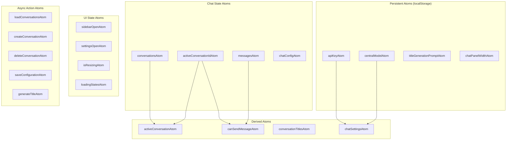

# Jotai Migration Plan: Complete State Management Rewrite

## Executive Summary

This plan outlines a complete rewrite of the chat application's state management using Jotai, addressing critical issues including excessive prop drilling, fragmented state management, and performance bottlenecks. The migration will restructure the entire frontend architecture for maximum benefit while optimizing API integration patterns.

## Current State Analysis

### Identified Problems

1. **Excessive Prop Drilling**
   - [`ChatPage`](frontend/src/app/simple-chatbot/page.tsx:40) manages 15+ state variables
   - Props passed through 3-4 component layers
   - Tight coupling between parent and child components

2. **Fragmented State Management**
   - Settings duplicated in [`ChatPage`](frontend/src/app/simple-chatbot/page.tsx:44) and [`SettingsMenu`](frontend/src/components/Settings/SettingsMenu.tsx:24)
   - Conversation state scattered across multiple useState hooks
   - No single source of truth for application state

3. **useChat Integration Complexity**
   - Messages managed by both [`useChat`](frontend/src/app/simple-chatbot/page.tsx:120) and local state
   - Synchronization issues between different state sources
   - Complex useEffect chains for message updates

4. **Performance Issues**
   - Entire ChatPage re-renders on any state change
   - No granular update optimization
   - Heavy component tree re-computation

5. **API Call Fragmentation**
   - Scattered fetch calls across components
   - No centralized error handling
   - Inconsistent loading states

## Migration Architecture

### Atom Structure Design



## Implementation Plan

### Phase 1: Core Infrastructure Setup

#### 1.1 Install Dependencies
```bash
npm install jotai jotai-devtools
npm install --save-dev @types/node
```

#### 1.2 Create Atom Architecture

**File: `src/atoms/index.ts`**
```typescript
// Re-export all atoms for easy importing
export * from './chatAtoms'
export * from './settingsAtoms'
export * from './uiAtoms'
export * from './asyncAtoms'
```

**File: `src/atoms/settingsAtoms.ts`**
```typescript
import { atom } from 'jotai'
import { atomWithStorage } from 'jotai/utils'

// Persistent settings atoms
export const apiKeyAtom = atomWithStorage('apiKey', '')
export const centralModelAtom = atomWithStorage('centralModel', 'openrouter')
export const titleGenerationPromptAtom = atomWithStorage('titleGenerationPrompt', '')

// Derived settings atom
export const settingsAtom = atom(
  (get) => ({
    apiKey: get(apiKeyAtom),
    centralModel: get(centralModelAtom),
    titleGenerationPrompt: get(titleGenerationPromptAtom)
  })
)

// Settings validation atom
export const isSettingsValidAtom = atom(
  (get) => {
    const settings = get(settingsAtom)
    return settings.apiKey.length > 0 && settings.centralModel.length > 0
  }
)
```

**File: `src/atoms/chatAtoms.ts`**
```typescript
import { atom } from 'jotai'
import { atomWithStorage } from 'jotai/utils'
import type { Message } from '@ai-sdk/react'

export interface Conversation {
  id: string
  title: string
  messages: Message[]
  lastMessageTime?: number
}

export interface ChatConfig {
  modelName: string
  systemDirective: string
  temperature: number
}

// Core chat state
export const conversationsAtom = atom<Conversation[]>([])
export const activeConversationIdAtom = atom<string | null>(null)
export const messagesAtom = atom<Message[]>([])

// Chat configuration
export const chatConfigAtom = atom<ChatConfig>({
  modelName: 'anthropic/claude-3.5-haiku',
  systemDirective: '',
  temperature: 0.7
})

// Configuration change tracking
export const configChangedAtom = atom(false)

// Derived atoms
export const activeConversationAtom = atom(
  (get) => {
    const conversations = get(conversationsAtom)
    const activeId = get(activeConversationIdAtom)
    return conversations.find(c => c.id === activeId) || null
  }
)

export const canSendMessageAtom = atom(
  (get) => {
    const activeId = get(activeConversationIdAtom)
    const messages = get(messagesAtom)
    return activeId !== null
  }
)

// Chat panel width (persistent)
export const chatPanelWidthAtom = atomWithStorage('chatPanelWidth', 70)
```

**File: `src/atoms/uiAtoms.ts`**
```typescript
import { atom } from 'jotai'

// UI state atoms
export const sidebarOpenAtom = atom(true)
export const settingsOpenAtom = atom(false)
export const isResizingAtom = atom(false)

// Loading states
export const loadingStatesAtom = atom({
  conversations: false,
  messages: false,
  creating: false,
  deleting: false,
  saving: false,
  generating: false
})

// Error states
export const errorStatesAtom = atom<{
  conversations?: string
  messages?: string
  chat?: string
}>({})
```

**File: `src/atoms/asyncAtoms.ts`**
```typescript
import { atom } from 'jotai'
import { 
  conversationsAtom, 
  activeConversationIdAtom, 
  messagesAtom,
  chatConfigAtom,
  configChangedAtom 
} from './chatAtoms'
import { loadingStatesAtom, errorStatesAtom } from './uiAtoms'

// Load conversations from API
export const loadConversationsAtom = atom(
  null,
  async (get, set) => {
    set(loadingStatesAtom, prev => ({ ...prev, conversations: true }))
    set(errorStatesAtom, prev => ({ ...prev, conversations: undefined }))
    
    try {
      const response = await fetch('/api/conversations/list')
      if (!response.ok) throw new Error('Failed to fetch conversations')
      
      const data = await response.json()
      const conversations = data.map((conv: any) => ({
        id: conv.id,
        title: conv.title || conv.name || `Chat ${conv.id.substring(0, 8)}`,
        messages: [],
        lastMessageTime: conv.last_message_time
      }))
      
      set(conversationsAtom, conversations)
      
      // Auto-select first conversation if none active
      const activeId = get(activeConversationIdAtom)
      if (!activeId && conversations.length > 0) {
        set(activeConversationIdAtom, conversations[0].id)
        set(loadMessagesAtom, conversations[0].id)
      }
    } catch (error) {
      set(errorStatesAtom, prev => ({ 
        ...prev, 
        conversations: error instanceof Error ? error.message : 'Unknown error' 
      }))
    } finally {
      set(loadingStatesAtom, prev => ({ ...prev, conversations: false }))
    }
  }
)

// Load messages for specific conversation
export const loadMessagesAtom = atom(
  null,
  async (get, set, conversationId: string) => {
    set(loadingStatesAtom, prev => ({ ...prev, messages: true }))
    set(errorStatesAtom, prev => ({ ...prev, messages: undefined }))
    
    try {
      const response = await fetch(`/api/conversations/${conversationId}/messages`)
      if (!response.ok) throw new Error('Failed to load messages')
      
      const data = await response.json()
      const formattedMessages = data.messages.map((msg: any) => ({
        id: `${msg.role}-${Math.random().toString(36).substring(2, 9)}`,
        role: msg.role,
        content: msg.content
      }))
      
      set(messagesAtom, formattedMessages)
      
      // Load conversation config
      set(loadConversationConfigAtom, conversationId)
    } catch (error) {
      set(errorStatesAtom, prev => ({ 
        ...prev, 
        messages: error instanceof Error ? error.message : 'Unknown error' 
      }))
      set(messagesAtom, [])
    } finally {
      set(loadingStatesAtom, prev => ({ ...prev, messages: false }))
    }
  }
)

// Load conversation configuration
export const loadConversationConfigAtom = atom(
  null,
  async (get, set, conversationId: string) => {
    try {
      const response = await fetch(`/api/conversations/${conversationId}/config`)
      if (!response.ok) return // Config might not exist yet
      
      const data = await response.json()
      set(chatConfigAtom, {
        modelName: data.model_name || 'anthropic/claude-3.5-haiku',
        systemDirective: data.system_directive || '',
        temperature: data.temperature ?? 0.7
      })
      set(configChangedAtom, false)
    } catch (error) {
      console.error('Failed to load conversation config:', error)
    }
  }
)

// Create new conversation
export const createConversationAtom = atom(
  null,
  async (get, set) => {
    set(loadingStatesAtom, prev => ({ ...prev, creating: true }))
    
    try {
      const response = await fetch('/api/conversations/create', {
        method: 'POST'
      })
      if (!response.ok) throw new Error('Failed to create conversation')
      
      const data = await response.json()
      const newConversation = {
        id: data.conversation_id,
        title: 'New Conversation',
        messages: [],
        lastMessageTime: undefined
      }
      
      set(conversationsAtom, prev => [...prev, newConversation])
      set(activeConversationIdAtom, newConversation.id)
      set(messagesAtom, [])
      
      return newConversation.id
    } catch (error) {
      throw error
    } finally {
      set(loadingStatesAtom, prev => ({ ...prev, creating: false }))
    }
  }
)

// Delete conversation
export const deleteConversationAtom = atom(
  null,
  async (get, set, conversationId: string) => {
    set(loadingStatesAtom, prev => ({ ...prev, deleting: true }))
    
    try {
      const response = await fetch(`/api/conversations/${conversationId}`, {
        method: 'DELETE'
      })
      if (!response.ok) throw new Error('Failed to delete conversation')
      
      const conversations = get(conversationsAtom)
      const updatedConversations = conversations.filter(c => c.id !== conversationId)
      set(conversationsAtom, updatedConversations)
      
      // Handle active conversation deletion
      const activeId = get(activeConversationIdAtom)
      if (activeId === conversationId) {
        if (updatedConversations.length > 0) {
          const newActiveId = updatedConversations[0].id
          set(activeConversationIdAtom, newActiveId)
          set(loadMessagesAtom, newActiveId)
        } else {
          set(activeConversationIdAtom, null)
          set(messagesAtom, [])
        }
      }
    } catch (error) {
      throw error
    } finally {
      set(loadingStatesAtom, prev => ({ ...prev, deleting: false }))
    }
  }
)

// Save conversation configuration
export const saveConfigurationAtom = atom(
  null,
  async (get, set) => {
    const activeId = get(activeConversationIdAtom)
    if (!activeId) throw new Error('No active conversation')
    
    const config = get(chatConfigAtom)
    set(loadingStatesAtom, prev => ({ ...prev, saving: true }))
    
    try {
      const response = await fetch('/api/conversations/config', {
        method: 'POST',
        headers: { 'Content-Type': 'application/json' },
        body: JSON.stringify({
          conversation_id: activeId,
          model_name: config.modelName,
          system_directive: config.systemDirective || null,
          temperature: Math.min(2, Math.max(0, config.temperature))
        })
      })
      
      if (!response.ok) throw new Error('Failed to save configuration')
      
      set(configChangedAtom, false)
      // Reload config to ensure sync
      set(loadConversationConfigAtom, activeId)
    } catch (error) {
      throw error
    } finally {
      set(loadingStatesAtom, prev => ({ ...prev, saving: false }))
    }
  }
)

// Generate conversation title
export const generateTitleAtom = atom(
  null,
  async (get, set, conversationId: string) => {
    set(loadingStatesAtom, prev => ({ ...prev, generating: true }))
    
    try {
      const response = await fetch(`/api/conversations/${conversationId}/generate-title`, {
        method: 'POST',
        headers: { 'Content-Type': 'application/json' }
      })
      
      if (!response.ok) throw new Error('Failed to generate title')
      
      const data = await response.json()
      if (data?.title) {
        set(conversationsAtom, prev => prev.map(conv => 
          conv.id === conversationId ? { ...conv, title: data.title } : conv
        ))
        return data.title
      }
    } catch (error) {
      console.error('Error generating title:', error)
      throw error
    } finally {
      set(loadingStatesAtom, prev => ({ ...prev, generating: false }))
    }
  }
)

// Update messages (for useChat integration)
export const updateMessagesAtom = atom(
  null,
  (get, set, newMessages: Message[]) => {
    set(messagesAtom, newMessages)
    
    // Update conversation messages in the conversations list
    const activeId = get(activeConversationIdAtom)
    if (activeId) {
      set(conversationsAtom, prev => prev.map(conv => 
        conv.id === activeId ? { ...conv, messages: newMessages } : conv
      ))
    }
  }
)
```

### Phase 2: Provider Setup and DevTools

**File: `src/providers/JotaiProvider.tsx`**
```typescript
'use client'

import { Provider } from 'jotai'
import { DevTools } from 'jotai-devtools'

interface JotaiProviderProps {
  children: React.ReactNode
}

export function JotaiProvider({ children }: JotaiProviderProps) {
  return (
    <Provider>
      {process.env.NODE_ENV === 'development' && <DevTools />}
      {children}
    </Provider>
  )
}
```

**Update: `src/app/layout.tsx`**
```typescript
import { JotaiProvider } from '@/providers/JotaiProvider'

export default function RootLayout({
  children,
}: {
  children: React.ReactNode
}) {
  return (
    <html lang="en">
      <body>
        <JotaiProvider>
          {children}
        </JotaiProvider>
      </body>
    </html>
  )
}
```

### Phase 3: Custom Hooks for Complex Logic

**File: `src/hooks/useChatWithJotai.ts`**
```typescript
import { useAtom, useSetAtom } from 'jotai'
import { useChat } from '@ai-sdk/react'
import { 
  activeConversationIdAtom, 
  messagesAtom, 
  chatConfigAtom,
  updateMessagesAtom 
} from '@/atoms'

export function useChatWithJotai() {
  const [activeConversationId] = useAtom(activeConversationIdAtom)
  const [messages] = useAtom(messagesAtom)
  const [config] = useAtom(chatConfigAtom)
  const updateMessages = useSetAtom(updateMessagesAtom)

  const chat = useChat({
    id: activeConversationId || undefined,
    initialMessages: messages,
    api: '/api/chat',
    body: {
      conversation_id: activeConversationId,
      model_name: config.modelName,
      system_directive: config.systemDirective,
      temperature: config.temperature,
    },
    streamProtocol: 'text',
    onFinish: (message) => {
      console.log('AI response received:', message.content)
    },
    onError: (err) => {
      console.error('Chat error:', err)
    }
  })

  // Sync useChat messages with Jotai state
  React.useEffect(() => {
    if (chat.messages.length !== messages.length || 
        JSON.stringify(chat.messages) !== JSON.stringify(messages)) {
      updateMessages(chat.messages)
    }
  }, [chat.messages, messages, updateMessages])

  return {
    ...chat,
    canSendMessage: !!activeConversationId
  }
}
```

**File: `src/hooks/useConversationManagement.ts`**
```typescript
import { useAtom, useSetAtom } from 'jotai'
import { useRouter, useSearchParams } from 'next/navigation'
import { useCallback, useEffect } from 'react'
import {
  conversationsAtom,
  activeConversationIdAtom,
  loadConversationsAtom,
  loadMessagesAtom,
  createConversationAtom,
  deleteConversationAtom
} from '@/atoms'

export function useConversationManagement() {
  const router = useRouter()
  const searchParams = useSearchParams()
  
  const [conversations] = useAtom(conversationsAtom)
  const [activeConversationId, setActiveConversationId] = useAtom(activeConversationIdAtom)
  
  const loadConversations = useSetAtom(loadConversationsAtom)
  const loadMessages = useSetAtom(loadMessagesAtom)
  const createConversation = useSetAtom(createConversationAtom)
  const deleteConversation = useSetAtom(deleteConversationAtom)

  // Load conversations on mount
  useEffect(() => {
    loadConversations()
  }, [loadConversations])

  // Handle URL synchronization
  useEffect(() => {
    const urlConversationId = searchParams.get('conv')
    if (urlConversationId && urlConversationId !== activeConversationId) {
      setActiveConversationId(urlConversationId)
      loadMessages(urlConversationId)
    }
  }, [searchParams, activeConversationId, setActiveConversationId, loadMessages])

  // Update URL when active conversation changes
  useEffect(() => {
    const currentUrlId = searchParams.get('conv')
    if (activeConversationId && currentUrlId !== activeConversationId) {
      router.push(`?conv=${activeConversationId}`, { scroll: false })
    } else if (!activeConversationId && currentUrlId) {
      router.push('/simple-chatbot', { scroll: false })
    }
  }, [activeConversationId, router, searchParams])

  const handleSelectConversation = useCallback((id: string) => {
    if (id !== activeConversationId) {
      setActiveConversationId(id)
      loadMessages(id)
    }
  }, [activeConversationId, setActiveConversationId, loadMessages])

  const handleCreateConversation = useCallback(async () => {
    try {
      await createConversation()
    } catch (error) {
      console.error('Error creating conversation:', error)
      alert('Failed to create new conversation')
    }
  }, [createConversation])

  const handleDeleteConversation = useCallback(async (id: string) => {
    try {
      await deleteConversation(id)
    } catch (error) {
      console.error('Error deleting conversation:', error)
      alert('Failed to delete conversation')
    }
  }, [deleteConversation])

  return {
    conversations,
    activeConversationId,
    handleSelectConversation,
    handleCreateConversation,
    handleDeleteConversation
  }
}
```

### Phase 4: Component Refactoring

**File: `src/app/simple-chatbot/page.tsx` (Complete Rewrite)**
```typescript
'use client'

import { SidebarProvider } from '@/components/ui/sidebar'
import { ConversationSidebar } from '@/components/Chat/ConversationSidebar'
import { ChatDisplay } from '@/components/Chat/ChatDisplay'
import { ChatInput } from '@/components/Chat/ChatInput'
import { ConfigPanel } from '@/components/Chat/ConfigPanel'
import { ResizableLayout } from '@/components/Chat/ResizableLayout'
import { useConversationManagement } from '@/hooks/useConversationManagement'
import { useChatWithJotai } from '@/hooks/useChatWithJotai'

export default function ChatPage() {
  const {
    conversations,
    activeConversationId,
    handleSelectConversation,
    handleCreateConversation,
    handleDeleteConversation
  } = useConversationManagement()

  const chat = useChatWithJotai()

  return (
    <SidebarProvider>
      <div className="flex h-screen w-full max-w-full bg-background overflow-hidden">
        <ConversationSidebar
          conversations={conversations}
          activeConversation={activeConversationId}
          onSelectConversation={handleSelectConversation}
          onCreateNewConversation={handleCreateConversation}
          onDeleteConversation={handleDeleteConversation}
        />

        <ResizableLayout>
          <ChatDisplay 
            messages={chat.messages} 
            isLoading={chat.isLoading} 
          />
          <ChatInput
            input={chat.input}
            handleInputChange={chat.handleInputChange}
            handleSubmit={chat.handleSubmit}
            isLoading={chat.isLoading}
            isConversationActive={chat.canSendMessage}
          />
          <ConfigPanel />
        </ResizableLayout>
      </div>
    </SidebarProvider>
  )
}
```

**File: `src/components/Chat/ResizableLayout.tsx`**
```typescript
'use client'

import { useAtom } from 'jotai'
import { useCallback, useEffect, useRef } from 'react'
import { SidebarTrigger } from '@/components/ui/sidebar'
import { chatPanelWidthAtom, isResizingAtom, activeConversationAtom } from '@/atoms'

interface ResizableLayoutProps {
  children: [React.ReactNode, React.ReactNode, React.ReactNode] // ChatDisplay, ChatInput, ConfigPanel
}

export function ResizableLayout({ children }: ResizableLayoutProps) {
  const [chatPanelWidth, setChatPanelWidth] = useAtom(chatPanelWidthAtom)
  const [isResizing, setIsResizing] = useAtom(isResizingAtom)
  const [activeConversation] = useAtom(activeConversationAtom)
  const mainContentRef = useRef<HTMLDivElement>(null)

  const handleResizeStart = useCallback((e: React.MouseEvent) => {
    e.preventDefault()
    setIsResizing(true)
    document.body.style.cursor = 'col-resize'
  }, [setIsResizing])

  const handleResizeMove = useCallback((e: MouseEvent) => {
    if (!isResizing || !mainContentRef.current) return
    
    const containerRect = mainContentRef.current.getBoundingClientRect()
    const relativeX = e.clientX - containerRect.left
    const newWidthPercent = (relativeX / containerRect.width) * 100
    
    if (newWidthPercent >= 30 && newWidthPercent <= 90) {
      setChatPanelWidth(newWidthPercent)
    }
  }, [isResizing, setChatPanelWidth])

  const handleResizeEnd = useCallback(() => {
    setIsResizing(false)
    document.body.style.cursor = ''
  }, [setIsResizing])

  useEffect(() => {
    if (isResizing) {
      document.addEventListener('mousemove', handleResizeMove)
      document.addEventListener('mouseup', handleResizeEnd)
      return () => {
        document.removeEventListener('mousemove', handleResizeMove)
        document.removeEventListener('mouseup', handleResizeEnd)
      }
    }
  }, [isResizing, handleResizeMove, handleResizeEnd])

  return (
    <div ref={mainContentRef} className="flex flex-1 h-full overflow-hidden max-w-full">
      <div 
        className="flex flex-col h-full relative"
        style={{ width: `${chatPanelWidth}%` }}
      >
        <header className="border-b p-4 flex items-center justify-between">
          <div className="flex items-center">
            <SidebarTrigger className="mr-2 md:hidden" />
            <h1 className="text-xl font-bold">
              {activeConversation?.title || "Chat"}
            </h1>
          </div>
        </header>

        {children[0]} {/* ChatDisplay */}
        {children[1]} {/* ChatInput */}
        
        <div 
          className="absolute right-0 top-0 bottom-0 w-4 cursor-col-resize hover:bg-primary/20 active:bg-primary/40 z-50 flex items-center justify-center"
          onMouseDown={handleResizeStart}
        >
          <div className="h-12 w-[3px] bg-border rounded-full"></div>
        </div>
      </div>

      <div 
        className="flex flex-col h-full border-l"
        style={{ width: `${100 - chatPanelWidth}%` }}
      >
        {children[2]} {/* ConfigPanel */}
      </div>
    </div>
  )
}
```

**File: `src/components/Chat/ConfigPanel.tsx` (Refactored)**
```typescript
'use client'

import { useAtom, useSetAtom } from 'jotai'
import { Button } from '@/components/ui/button'
import { 
  chatConfigAtom, 
  configChangedAtom, 
  saveConfigurationAtom,
  canSendMessageAtom,
  loadingStatesAtom 
} from '@/atoms'

export function ConfigPanel() {
  const [config, setConfig] = useAtom(chatConfigAtom)
  const [configChanged, setConfigChanged] = useAtom(configChangedAtom)
  const [canSendMessage] = useAtom(canSendMessageAtom)
  const [loadingStates] = useAtom(loadingStatesAtom)
  const saveConfiguration = useSetAtom(saveConfigurationAtom)

  const handleConfigChange = <T extends keyof typeof config>(
    key: T, 
    value: typeof config[T]
  ) => {
    setConfig(prev => ({ ...prev, [key]: value }))
    setConfigChanged(true)
  }

  const handleSave = async () => {
    try {
      await saveConfiguration()
    } catch (error) {
      console.error('Error saving configuration:', error)
      alert('Failed to save configuration')
    }
  }

  return (
    <div className="flex flex-col h-full w-full">
      <header className="border-b p-4">
        <h2 className="text-lg font-semibold">Configuration</h2>
      </header>
      <div className="flex-1 p-4 overflow-auto">
        <div className="space-y-6">
          <div>
            <label htmlFor="model-selection" className="text-sm font-medium mb-2 block">
              Model Selection
            </label>
            <select
              id="model-selection"
              className="w-full p-2 border rounded bg-background"
              value={config.modelName}
              onChange={(e) => handleConfigChange('modelName', e.target.value)}
              disabled={!canSendMessage}
            >
              <option value="anthropic/claude-3.5-haiku">Claude 3.5 Haiku</option>
              <option value="anthropic/claude-3.7-sonnet">Claude 3.7 Sonnet</option>
              <option value="openai/gpt-4.1-nano">GPT-4.1 Nano</option>
              <option value="openai/gpt-4.1-mini">GPT-4.1 Mini</option>
              <option value="openai/gpt-4.1">GPT-4.1</option>
              <option value="x-ai/grok-3-mini-beta">Grok 3 Mini Beta</option>
              <option value="google/gemma-3-12b-it:free">Gemma 3 12B</option>
              <option value="google/gemini-2.5-flash-preview">Gemini 2.5 Flash Preview</option>
            </select>
          </div>

          <div>
            <label htmlFor="system-directive" className="text-sm font-medium mb-2 block">
              System Directive
            </label>
            <textarea
              id="system-directive"
              className="w-full h-40 p-2 border rounded bg-background resize-none"
              placeholder="Enter system instructions for the AI..."
              value={config.systemDirective}
              onChange={(e) => handleConfigChange('systemDirective', e.target.value)}
              disabled={!canSendMessage}
            />
          </div>

          <div>
            <label htmlFor="temperature" className="text-sm font-medium mb-2 block">
              Temperature: {config.temperature.toFixed(1)}
            </label>
            <input
              id="temperature"
              type="range"
              min="0"
              max="2"
              step="0.1"
              value={config.temperature}
              onChange={(e) => handleConfigChange('temperature', parseFloat(e.target.value))}
              className="w-full h-2 bg-gray-200 rounded-lg appearance-none cursor-pointer dark:bg-gray-700"
              disabled={!canSendMessage}
            />
            <div className="flex justify-between text-xs text-muted-foreground mt-1">
              <span>Precise</span>
              <span>Balanced</span>
              <span>Creative</span>
            </div>
          </div>

          <Button
            className="w-full"
            onClick={handleSave}
            disabled={!configChanged || !canSendMessage || loadingStates.saving}
          >
            {loadingStates.saving ? 'Saving...' : 'Apply Configuration'}
          </Button>
        </div>
      </div>
    </div>
  )
}
```

**File: `src/components/Settings/SettingsMenu.tsx` (Refactored)**
```typescript
'use client'

import { useAtom } from 'jotai'
import { useState } from 'react'
import { Settings } from 'lucide-react'
import { Button } from '@/components/ui/button'
import { Input } from '@/components/ui/input'
import { Textarea } from '@/components/ui/textarea'
import {
  Sheet,
  SheetTrigger,
  SheetContent,
  SheetHeader,
  SheetTitle,
  SheetDescription,
  SheetFooter,
} from '@/components/ui/sheet'
import { 
  settingsAtom, 
  apiKeyAtom, 
  centralModelAtom, 
  titleGenerationPromptAtom 
} from '@/atoms'

export function SettingsMenu() {
  const [settings] = useAtom(settingsAtom)
  const [apiKey, setApiKey] = useAtom(apiKeyAtom)
  const [centralModel, setCentralModel] = useAtom(centralModelAtom)
  const [titlePrompt, setTitlePrompt] = useAtom(titleGenerationPromptAtom)
  
  const [isOpen, setIsOpen] = useState(false)
  const [isLoading, setIsLoading] = useState(false)
  const [apiKeyConfigured, setApiKeyConfigured] = useState(false)
  const [tempApiKey, setTempApiKey] = useState('')

  const loadSettings = async () => {
    setIsLoading(true)
    try {
      const response = await fetch('/api/settings')
      if (response.ok) {
        const data = await response.json()
        if (data.central_model) setCentralModel(data.central_model)
        if (data.title_generation_prompt) setTitlePrompt(data.title_generation_prompt)
        setApiKeyConfigured(!!data.api_key_configured)
      }
    } catch (error) {
      console.error('Error loading settings:', error)
    } finally {
      setIsLoading(false)
    }
  }

  const saveSettings = async () => {
    try {
      const response = await fetch('/api/settings', {
        method: 'POST',
        headers: { 'Content-Type': 'application/json' },
        body: JSON.stringify({
          centralModel,
          apiKey: tempApiKey || undefined,
          titleGenerationPrompt: titlePrompt
        })
      })
      
      if (!response.ok) throw new Error('Failed to save settings')
      
      if (tempApiKey) {
        setApiKey(tempApiKey)
        setTempApiKey('')
      }
      setIsOpen(false)
    } catch (error) {
      console.error('Error saving settings:', error)
      alert('Failed to save settings')
    }
  }

  const handleOpenChange = (open: boolean) => {
    setIsOpen(open)
    if (open) {
      loadSettings()
      setTempApiKey('')
    }
  }

  return (
    <Sheet open={isOpen} onOpenChange={handleOpenChange}>
      <SheetTrigger asChild>
        <Button variant="ghost" size="icon">
          <Settings className="h-6 w-6" />
          <span className="sr-only">Settings</span>
        </Button>
      </SheetTrigger>
      <SheetContent>
        <SheetHeader>
          <SheetTitle>App Settings</SheetTitle>
          <SheetDescription>
            Configure application-wide settings here.
          </SheetDescription>
        </SheetHeader>
        
        {isLoading ? (
          <div className="py-4 flex items-center justify-center">Loading settings...</div>
        ) : (
          <div className="py-4 space-y-6">
            <div className="space-y-2">
              <label htmlFor="central-model" className="text-sm font-medium block">
                Central Model
              </label>
              <select
                id="central-model"
                value={centralModel}
                onChange={(e) => setCentralModel(e.target.value)}
                className="w-full p-2 border rounded bg-background"
              >
                <option value="claude-3.5-haiku">Claude 3.5 Haiku</option>
                <option value="claude-3.7-sonnet">Claude 3.7 Sonnet</option>
              </select>
            </div>
            
            <div className="space-y-2">
              <label htmlFor="api-key" className="text-sm font-medium block">
                OpenRouter API Key {apiKeyConfigured && <span className="text-xs text-green-500">(Configured)</span>}
              </label>
              <Input
                id="api-key"
                type="password"
                placeholder={apiKeyConfigured ? "API key is configured" : "Enter your OpenRouter API key"}
                value={tempApiKey}
                onChange={(e) => setTempApiKey(e.target.value)}
              />
              <p className="text-xs text-muted-foreground">
                Your API key is stored securely and sent only to the backend.
              </p>
            </div>
            
            <div className="space-y-2">
              <label htmlFor="title-generation-prompt" className="text-sm font-medium block">
                Custom Title Generation Prompt
              </label>
              <Textarea
                id="title-generation-prompt"
                placeholder="Enter custom prompt for generating chat titles (leave empty for default)"
                value={titlePrompt}
                onChange={(e) => setTitlePrompt(e.target.value)}
                className="min-h-[100px]"
              />
              <p className="text-xs text-muted-foreground">
                Customize how chat titles are generated. The conversation context will be appended to this prompt.
              </p>
            </div>
          </div>
        )}
        
        <SheetFooter>
          <Button className="w-full" onClick={saveSettings} disabled={isLoading}>
            Save Settings
          </Button>
        </SheetFooter>
      </SheetContent>
    </Sheet>
  )
}
```

## Migration Benefits

### Performance Improvements
- **Granular Re-renders**: Only components using specific atoms re-render
- **Eliminated Prop Drilling**: Direct atom access in components
- **Optimized State Updates**: Atomic updates prevent unnecessary re-computations
- **Memoized Derived State**: Computed values cached automatically

### Code Quality Improvements
- **Single Source of Truth**: All state centralized in atoms
- **Type Safety**: Full TypeScript integration with atom types
- **Testability**: Atoms can be tested in isolation
- **Maintainability**: Clear separation of concerns

### Developer Experience
- **DevTools Integration**: Real-time state inspection and time-travel debugging
- **Hot Reload Support**: State persists through development changes
- **Incremental Adoption**: Can be implemented gradually if needed

## Testing Strategy

### Unit Tests for Atoms
```typescript
// __tests__/atoms/chatAtoms.test.ts
import { createStore } from 'jotai'
import { conversationsAtom, activeConversationIdAtom, activeConversationAtom } from '@/atoms'

describe('Chat Atoms', () => {
  it('should derive active conversation correctly', () => {
    const store = createStore()
    
    const conversations = [
      { id: '1', title: 'Test 1', messages: [] },
      { id: '2', title: 'Test 2', messages: [] }
    ]
    
    store.set(conversationsAtom, conversations)
    store.set(activeConversationIdAtom, '2')
    
    const activeConversation = store.get(activeConversationAtom)
    expect(activeConversation?.title).toBe('Test 2')
  })
})
```

### Integration Tests
```typescript
// __tests__/hooks/useConversationManagement.test.tsx
import { renderHook } from '@testing-library/react'
import { Provider } from 'jotai'
import { useConversationManagement } from '@/hooks/useConversationManagement'

describe('useConversationManagement', () => {
  it('should load conversations on mount', async () => {
    const wrapper = ({ children }) => <Provider>{children}</Provider>
    const { result } = renderHook(() => useConversationManagement(), { wrapper })
    
    // Test conversation loading logic
  })
})
```

## Deployment Checklist

- [ ] Install Jotai dependencies
- [ ] Set up atom architecture
- [ ] Configure Jotai provider and DevTools
- [ ] Create custom hooks for complex logic
- [ ] Refactor main ChatPage component
- [ ] Update all child components to use atoms
- [ ] Implement ResizableLayout component
- [ ] Update SettingsMenu to use atoms
- [ ] Add comprehensive error handling
- [ ] Write unit and integration tests
- [ ] Update package.json scripts if needed
- [ ] Test in development environment
- [ ] Performance testing and optimization
- [ ] Deploy to production

## Risk Mitigation

### Potential Issues and Solutions

1. **useChat Integration Complexity**
   - **Risk**: Message synchronization issues
   - **Solution**: Custom hook with careful useEffect management and state comparison

2. **SSR Hydration Mismatches**
   - **Risk**: atomWithStorage causing hydration errors
   - **Solution**: Proper SSR handling with conditional rendering

3. **Performance Regression**
   - **Risk**: Too many atom subscriptions
   - **Solution**: Careful atom design and selective subscriptions

4. **State Migration**
   - **Risk**: Loss of existing user data
   - **Solution**: Gradual migration with fallback to localStorage

## Conclusion

This comprehensive migration plan transforms the chat application from a prop-drilling, performance-limited architecture to a modern, scalable state management system using Jotai. The atomic approach eliminates the identified issues while providing superior developer experience and application performance.

The complete rewrite approach ensures maximum benefit from Jotai's capabilities while optimizing API integration patterns for better maintainability and extensibility.